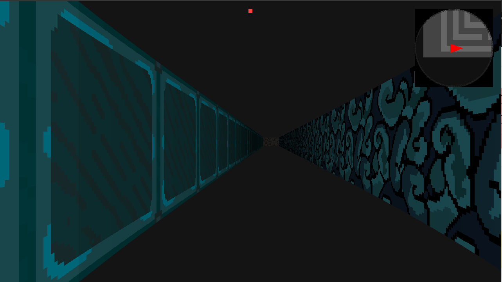

# Cub3D - 42 School Project

A 3D graphics project inspired by the famous Wolfenstein 3D game, built using raycasting technology.

## 📝 Description

Cub3D is a first-person 3D game engine built from scratch using the raycasting technique, similar to the one used in Wolfenstein 3D. The project is written in C and uses the MinilibX graphics library.

## 🚀 Features

### Mandatory Features ✅
- Smooth window management
- Textured walls in 4 different directions (North, South, East, West)
- Different colored floor and ceiling
- Keyboard controls for movement (W, A, S, D)
- Keyboard controls for camera rotation (Left/Right arrow keys)
- Clean window exit using the ESC key or window's close button
- Map parsing from `.cub` file format
- Map validation and error handling

### Bonus Features ⭐
#### Implemented ✅
- Wall collisions - Full implementation with smooth collision detection
- Minimap system - Dynamic minimap showing player position and walls
- Mouse rotation - Smooth camera control with mouse movement

#### Not Implemented ❌
- Animated sprite
- Doors that can open and close

## 🛠️ Installation

```bash
# Clone the repository with submodules
git clone https://github.com/jcoh3n/42-cub3d.git cub3D
cd cub3D

# Initialize and update submodules (for required libraries)
git submodule init
git submodule update

# Build the project
make
```

## 🎮 Usage

```bash
./cub3d maps/labyrinth.cub
```

### Map Format (.cub)
The game map should be provided in a `.cub` file format with the following structure:

```
NO ./path_to_north_texture.xpm
SO ./path_to_south_texture.xpm
WE ./path_to_west_texture.xpm
EA ./path_to_east_texture.xpm

F 220,100,0    # Floor RGB color
C 225,30,0     # Ceiling RGB color

# Map layout
        1111111111111111111111111
        1000000000110000000000001
        1011000001110000000000001
        1001000000000000000000001
111111111011000001110000000000001
100000000011000001110111111111111
11110111111111011100000010001
11110111111111011101010010001
11000000110101011100000010001
10000000000000001100000010001
10000000000000001101010010001
11000001110101011111011110N0111
11110111 1110101 101111010001
11111111 1111111 111111111111
```

Map Elements:
- `0`: Empty space
- `1`: Wall
- `N/S/E/W`: Player starting position and orientation
- Space: Valid map space outside the map

## 🎮 Controls

- `W`: Move forward
- `S`: Move backward
- `A`: Strafe left
- `D`: Strafe right
- `←`: Rotate camera left
- `→`: Rotate camera right
- `Mouse`: Camera rotation (when mouse control is enabled)
- `ESC`: Exit game
- `M`: Toggle mouse capture

## 🖼️ Screenshots


*Screenshot showing the 3D rendered view with textured walls and minimap*

## 🛠️ Technical Details

- Written in C
- Uses MinilibX graphics library
- Implements DDA (Digital Differential Analysis) algorithm for raycasting
- Features texture mapping and wall shading
- Includes collision detection
- Implements efficient rendering techniques

## 🤝 Contributors

- [jcohen](https://github.com/jcoh3n)
- [jowander](https://github.com/wanderfulife)

## 📝 License

This project is part of the 42 School curriculum and is licensed under the [42 License]. 